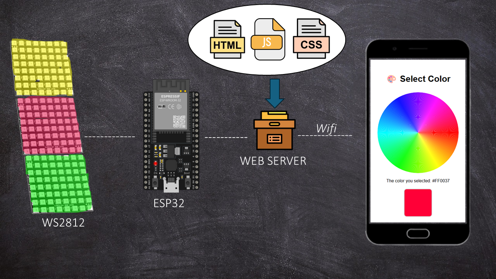
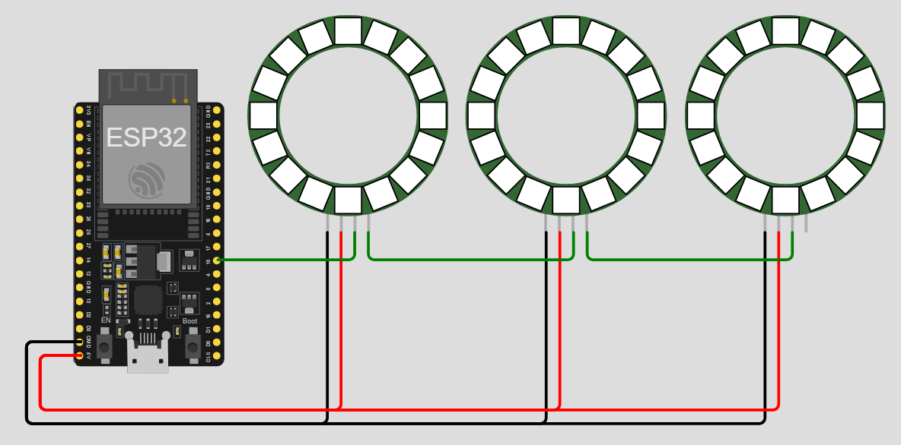
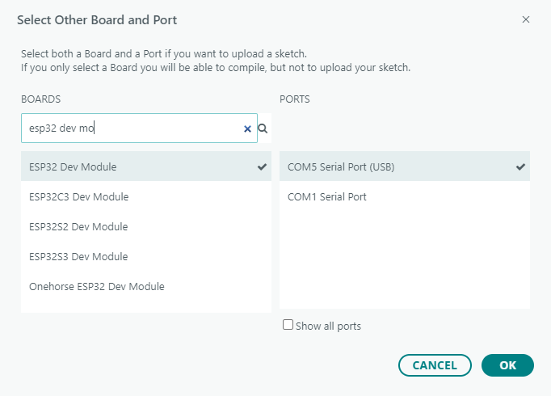
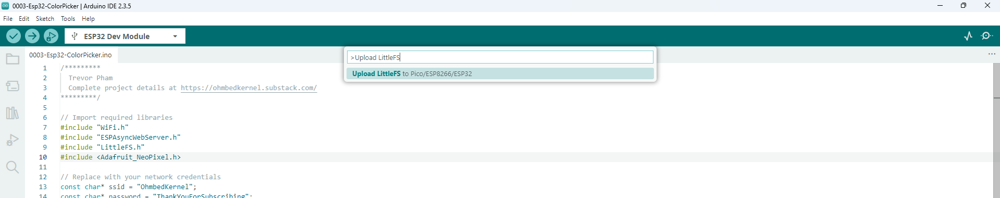
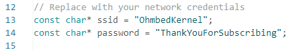
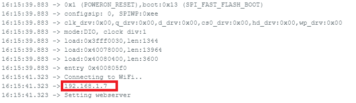
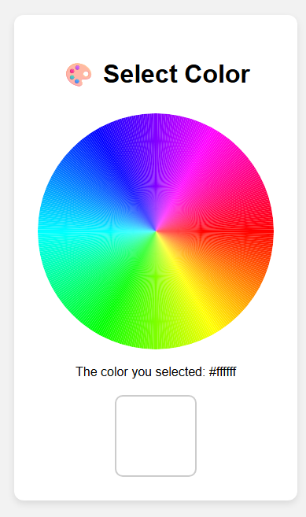

# 250720-ESP32-WebServer-Color-Picker

<h2>
1. Overview
</h2>

Let’s build a simple and interactive web-based color picker to control WS2812 RGB LEDs using the ESP32 microcontroller. The ESP32 will host a web server that allows you to choose any color from your browser and instantly apply it to the LEDs. This kind of setup is perfect for ambient lighting systems, DIY smart lamps, or just a fun way to learn about web interfaces and IoT

<h2>
2. Connection diagram
</h2>

Connect pin 16 of ESP32 to WS2812 led board, You can also connect WS2812 led boards in series together for expansion

<h2>
3. Upload webseriver file using LittleFs
</h2>

Select board and com port on your computer

Press [CTRL]+[SHIFT]+P to open the Plugin menu, then select >Upload LittleFS to Pico/ESP8266/ESP32

<h2>
4. Upload ESP32 firmware
</h2>

Change wifi name and password in code to your own 

Press the upload button on Arduino IDE and wait for the upload to finish 
Open Serial Monitor and check the IP address of the ESP32 (Ex: 192.168.1.7) 

<h2>
5. Testing
</h2>

Use your computer or phone to access the web browser 
Access the IP address of the ESP32 (Ex: 192.168.1.7) 
You will see the UI interface as follows: 

Click on any color on the rainbow circle, ESP32 will display the corresponding color on WS2812 <3

